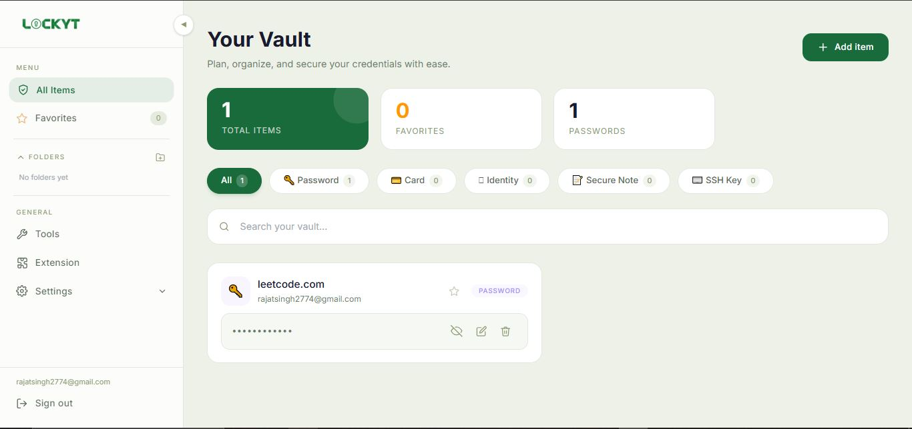
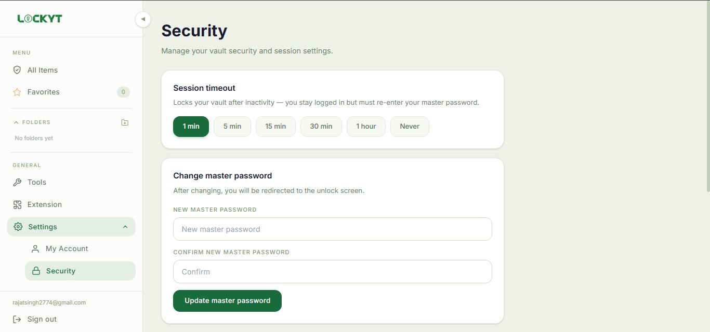
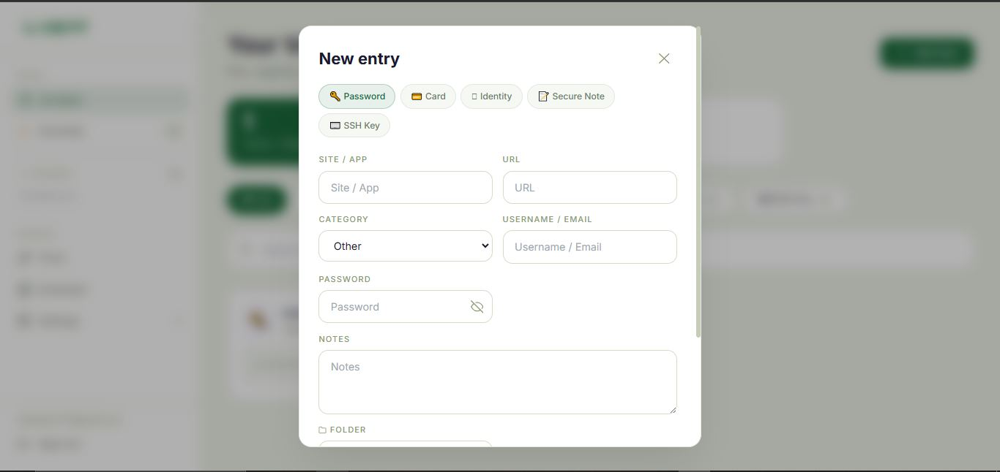
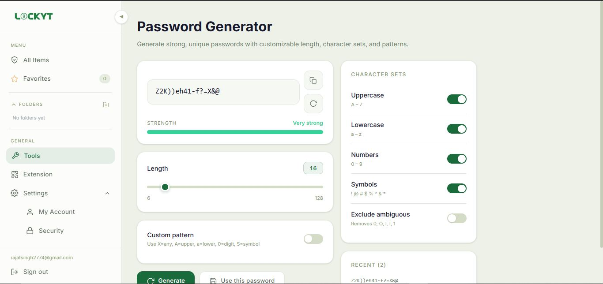
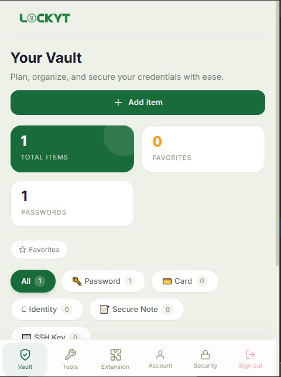
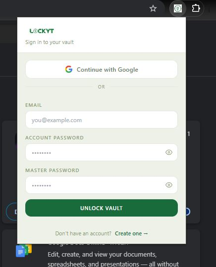

<div align="center">


# Lockyt

**A zero-knowledge, end-to-end encrypted password manager built for the modern web.**

[](https://react.dev)
[](https://firebase.google.com)
[](https://tailwindcss.com)
[](./LICENSE)

[Live Demo](https://your-lockyt-url.com) · [Chrome Extension](#chrome-extension) · [Report Bug](https://github.com/yourusername/lockyt/issues) · [Request Feature](https://github.com/yourusername/lockyt/issues)

</div>

---

## 📸 Screenshots

<div align="center">

<!-- Replace the src paths below with your actual mockup images -->

| Dashboard | Security Center |
|:---------:|:---------------:|
|  |  |

| Vault Entry | Password Generator |
|:-----------:|:-----------------:|
|  |  |

| Mobile View | Chrome Extension |
|:-----------:|:----------------:|
|  |  |

</div>

---

## 🔐 What is Lockyt?

Lockyt is a full-stack password manager that stores, encrypts, and syncs your credentials across all devices — without ever exposing your plaintext data to the server.

All encryption and decryption happens **entirely in your browser**. Your master password is never transmitted, never stored, and never seen by anyone but you. Even if the database were compromised, attackers would only find AES-256 encrypted ciphertext.

---

## ✨ Features

### Vault
- **5 secure item types** — Passwords, Credit Cards, Identities, Secure Notes, SSH Keys
- **Real-time sync** — Firestore `onSnapshot` keeps your vault live across all devices and tabs
- **Search & filter** — Quickly find entries by name, username, or item type
- **Copy to clipboard** — One-click copy with auto-clear after 30 seconds

### Security
- **Zero-knowledge encryption** — AES-256-GCM with client-side key derivation
- **PBKDF2 key derivation** — 600,000 SHA-256 iterations, salted with your Firebase UID
- **Breach detection** — Checks passwords against [HaveIBeenPwned](https://haveibeenpwned.com) using k-anonymity (your password never leaves your device)
- **Session timeout** — Automatically locks vault after configurable inactivity period

### Tools
- **Password generator** — Customisable length (6–128), character sets, and custom patterns


### Cross-device
- **Works on all platforms** — Desktop, tablet, and mobile responsive
- **Chrome Extension** — Autofills credentials on any website directly from your vault
- **Smart autofill** — Auto-fills if one match, shows a picker if multiple

---

## 🏗️ Architecture

```
┌─────────────────────────────────────────────────────┐
│                    Client (Browser)                  │
│                                                      │
│  ┌─────────────┐    ┌──────────────┐                │
│  │  React App  │    │   Chrome     │                │
│  │  (Vite)     │    │  Extension   │                │
│  └──────┬──────┘    └──────┬───────┘                │
│         │                  │                         │
│  ┌──────▼──────────────────▼───────┐                │
│  │         crypto.js               │                │
│  │  PBKDF2 key derivation          │                │
│  │  AES-256-GCM encrypt/decrypt    │                │
│  │  (Web Crypto API — no deps)     │                │
│  └──────────────┬──────────────────┘                │
└─────────────────┼───────────────────────────────────┘
                  │ Encrypted ciphertext only
┌─────────────────▼───────────────────────────────────┐
│                   Firebase                           │
│                                                      │
│  ┌──────────────┐    ┌──────────────┐               │
│  │ Firebase Auth│    │  Firestore   │               │
│  │ (Identity)   │    │  (Storage)   │               │
│  └──────────────┘    └──────────────┘               │
└─────────────────────────────────────────────────────┘
```

### Data stored in Firestore

```
users/
└── {uid}/
    ├── vault/
    │   └── meta              ← encrypted canary (verifies master password)
    └── passwords/
        └── {entryId}
            ├── site          ← plain  (for search)
            ├── username      ← plain  (for display)
            ├── password      ← AES-256-GCM encrypted
            ├── cardNumber    ← AES-256-GCM encrypted
            ├── notes         ← AES-256-GCM encrypted
            └── ...

---

## 🚀 Getting Started

### Prerequisites

- Node.js 18+
- A Firebase project with **Firestore** and **Authentication** enabled

### 1. Clone the repository

```bash
git clone https://github.com/Rajat2774/Password-manager.git
cd Lockora
```

### 2. Install dependencies

```bash
npm install
```

### 3. Configure Firebase

Create `src/firebase.js` with your Firebase config:

```js
import { initializeApp } from "firebase/app";
import { getAuth, GoogleAuthProvider } from "firebase/auth";
import { getFirestore } from "firebase/firestore";

const firebaseConfig = {
  apiKey:            "YOUR_API_KEY",
  authDomain:        "YOUR_PROJECT.firebaseapp.com",
  projectId:         "YOUR_PROJECT_ID",
  storageBucket:     "YOUR_PROJECT.appspot.com",
  messagingSenderId: "YOUR_SENDER_ID",
  appId:             "YOUR_APP_ID",
};

const app = initializeApp(firebaseConfig);
export const auth = getAuth(app);
export const googleProvider = new GoogleAuthProvider();
export const db = getFirestore(app);
```

### 4. Set Firestore security rules

In the Firebase Console → Firestore → Rules:

```js
rules_version = '2';
service cloud.firestore {
  match /databases/{database}/documents {
    match /users/{userId}/vault/{document} {
      allow read, write: if request.auth != null && request.auth.uid == userId;
    }
    match /users/{userId}/passwords/{document} {
      allow read, write: if request.auth != null && request.auth.uid == userId;
    }
    }
  }

```

### 5. Run locally

```bash
npm run dev
```

Open [http://localhost:5173](http://localhost:5173)

---

## 🧩 Chrome Extension

The Lockyt Chrome Extension enables autofill on any website.

### Install from source

1. Open `chrome://extensions`
2. Enable **Developer mode**
3. Click **Load unpacked**
4. Select the `lockora-extension/` folder

### Configure

Edit `lockora-extension/firebase-config.js` with your Firebase config (same as above).

### How it works

```
User visits a site with a login form
            ↓
Extension detects the form (content.js)
            ↓
Queries Firestore for matching entries (background.js)
            ↓
1 match  →  Auto-fills silently + shows toast
N matches →  Shows picker popup to select which credential
```

---

## 📁 Project Structure

```
lockora/
├── src/
│   ├── pages/
│   │   ├── SignIn.jsx
│   │   ├── SignUp.jsx
│   │   ├── UnlockVault.jsx
│   │   ├── Dashboard.jsx
│   │   └── SharePage.jsx
│   ├── components/
│   │   └── dashboard/
│   │       ├── Sidebar.jsx
│   │       ├── VaultCard.jsx
│   │       ├── VaultModal.jsx
│   │       ├── PasswordGenerator.jsx
│   │       ├── SecurityCenter.jsx
│   │       ├── ShareModal.jsx
│   │       ├── AccountSettings.jsx
│   │       ├── SecuritySettings.jsx
│   │       └── Icons.jsx
│   ├── utils/
│   │   ├── crypto.js          ← AES-256-GCM + PBKDF2
│   │   ├── breach.js          ← HaveIBeenPwned k-anonymity
│   │   └── vault.js           ← Shared helpers
│   ├── constants/
│   │   └── vault.js           ← VAULT_TYPES, FIELDS definitions
│   └── firebase.js
├── lockora-extension/
│   ├── manifest.json
│   ├── background.js
│   ├── content.js
│   ├── firebase-config.js
│   └── popup/
│       ├── popup.html
│       ├── popup.js
│       └── popup.css
└── public/
```

---

## 🔒 Security Model

| Layer | Implementation |
|---|---|
| Key derivation | PBKDF2-SHA256, 600,000 iterations, UID as salt |
| Encryption | AES-256-GCM with random IV per entry |
| Master password | Never stored, never transmitted — derived to key in browser only |
| Canary verification | Encrypted known value used to verify master password without storing it |
| Breach detection | k-anonymity — only first 5 chars of SHA-1 hash sent to HIBP API |
| Firebase rules | Per-user Firestore rules — no cross-user data access possible |

---

## 🗺️ Roadmap

- [ ] Vault export / import (Bitwarden CSV compatible)
- [ ] TOTP / 2FA code storage
- [ ] Firefox extension
- [ ] Dark / light theme toggle
- [ ] Audit log (per-entry view history)

---

## 🤝 Contributing

Contributions are welcome. Please open an issue first to discuss what you'd like to change.

```bash
# Fork the repo, then:
git checkout -b feature/your-feature
git commit -m "feat: add your feature"
git push origin feature/your-feature
# Open a Pull Request
```

---

## 📄 License

Distributed under the MIT License. See [`LICENSE`](./LICENSE) for details.

---

<div align="center">

Built with ❤️ using React, Firebase, and the Web Crypto API

**[Live website](https://lockyt.vercel.app)**

</div>